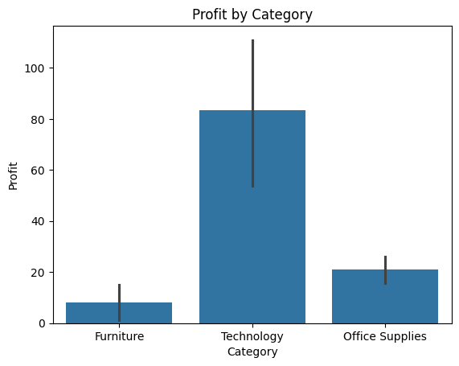
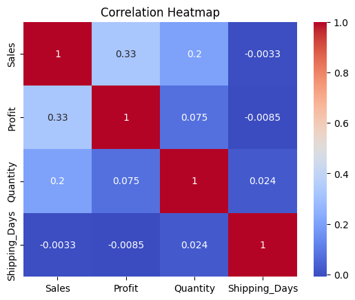
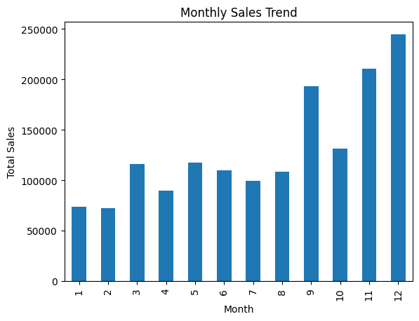
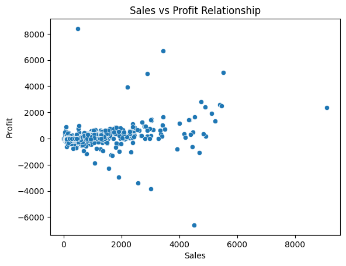

# Superstore Sales Data Analysis

## Project Overview
This project performs Exploratory Data Analysis (EDA) on a Superstore sales dataset to identify business insights related to sales performance, profitability, customer segments, and regional distribution.

## Tools Used
- Python
- Pandas
- NumPy
- Matplotlib
- Seaborn
- Jupyter Notebook

## Key Analysis
- Sales trends by year and month
- Customer segment analysis
- Category and sub-category profitability
- Shipping time analysis
- Regional sales performance
- Product return analysis

## Key Insights
- Sales increased significantly from 2019 to 2020.
- Consumer segment contributes the highest total sales.
- Technology category generates the highest profit.
- Some sub-categories like Tables, Bookcases, and Supplies show negative profit.
- Average shipping time is around 4 days.

## Dataset
Superstore Sales Dataset

## Visualizations

### Category vs Profit
Shows how profit varies across product categories.

### Correlation Heatmap
Shows the correlation between Sales, Profit, Quantity, and Shipping Days.

### Monthly Sales Trend
Displays how total sales change across months.

### Sales vs Profit Relationship
Shows the relationship between sales value and profit.

## Author
Soham Chavan
